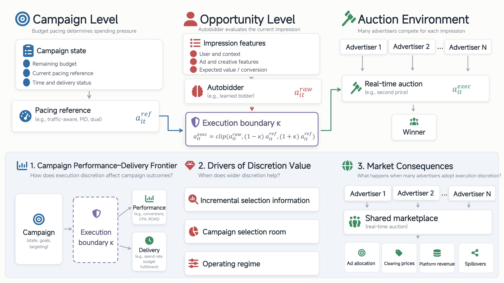

<div align="center">

# Managing Autobidder Execution under Campaign Pacing

**代码与数据发布** · *POM / Marketing Interface*

[](#how-to-reproduce)
[](#datasets)
[](README.md)

</div>

---

**中文** · [**English**](README.md)

---

<p align="center">
  
  <br><em>执行边界框架（Execution Boundary Framework）</em>
</p>

---

## 目录

- [项目概览](#whats-inside)
- [autobidder](#bidders)
- [pacing 控制器](#controllers)
- [目录结构](#layout)
- [如何复现](#how-to-reproduce)
- [数据集与下载链接](#datasets)
- [许可](#license)

---

<a id="whats-inside"></a>
## 项目概览

这篇论文研究一个出价裁量权问题：受 pacing 控制的 autobidder，出价到底该被允许多大空间（`κ`）？我们提出执行边界机制（execution width / boundary），并在多个学习型 autobidder、三类 pacing 控制器、三个数据集上做了评估。

| 模块 | 内容 | 位置 |
| --- | --- | --- |
| **核心评估器** | 单广告主*微观*回放 + 48 广告主同步*宏观*市场模拟器 + 参考 pacing 策略 | `code/auctionnet/` |
| **autobidder** | CQL、IQL、DT、GAS、SemBid——训练源码都在仓库里 | `code/bidders/` |
| **pacing 控制器** | traffic-aware、PID、dual（参考策略） | `code/auctionnet/micro/mandate_core_v2.py`、`code/common/reference_policies.py` |
| **数据集** | AuctionNet（Alimama AIGB）、T9Sim（带真值标注的模拟器）、iPinYou（真实竞价日志）——下载与提取脚本 | `data/` |
| **跨数据集分析** | iPinYou/T9Sim 聚合、κ 选择挑战、数据集规模核算 | `code/analysis/`、`code/kappa_selection/` |
| **图表** | 论文每个图表展示对应的源 CSV + 画图代码 | `plotting/` |
| **冻结配置** | 精确实验网格（κ 宽度、采纳比例、随机种子） | `configs/` |

---

<a id="bidders"></a>
## autobidder

| autobidder | 类型 | 训练入口 |
| --- | --- | --- |
| **CQL** | Conservative Q-Learning（torch.jit） | `code/bidders/sembid_cpa/bidding_train_env/baseline/cql/cql.py` |
| **IQL** | Implicit Q-Learning（torch.jit） | `code/bidders/sembid_cpa/bidding_train_env/baseline/iql/iql.py` |
| **DT** | Decision Transformer（`state_dim=16`、`K=20`） | `code/bidders/sembid_cpa/bidding_train_env/baseline/dt/dt.py` |
| **GAS** | Gradient-Ascent Strategy（DT 策略 + 重加权搜索 critic） | `code/bidders/gas/run/train_dt_baselines.py` + `code/bidders/gas/run/train_dt_critics.py` |
| **SemBid** | OpenLBM / Qwen2.5-0.5B 语言出价模型 | `code/bidders/sembid_cpa/Training/train_exp23_2048.py` |

> autobidder 的训练源码都在仓库里（入口见 `docs/REPRODUCTION.md` §3），评估时直接加载训练出来的 checkpoint。DT、SemBid 在 `code/bidders/sembid_cpa/` 下，GAS 在 `code/bidders/gas/` 下。

---

<a id="controllers"></a>
## pacing 控制器

traffic-aware、PID、dual 三种 pacing 用纯、可审计的参考策略实现，代码在
`code/common/reference_policies.py` 和 `code/auctionnet/micro/mandate_core_v2.py`。
执行边界（execution boundary）会把 autobidder 的原生出价相对参考动作做一次裁剪：

```text
enforce_action(raw, ref, κ)  →  clip 到 [max{0, ref·(1−κ)}, ref·(1+κ)]   (relative_hard)
```

---

<a id="layout"></a>
## 目录结构

```text
├── code/
│   ├── auctionnet/          # 核心评估器（微观 + 宏观）+ 通用参考策略
│   ├── bidders/             # autobidder 的训练 + 推理源码
│   ├── t9sim/               # T9Sim 模拟器包 + 回放驱动
│   ├── ipinyou/             # iPinYou 预处理 + 日志回放驱动
│   ├── kappa_selection/     # κ 选择挑战（01_protocol/02_configs/03_code + 冻结 06_results）
│   └── analysis/            # 跨数据集聚合 + 数据集规模核算
├── configs/                 # 冻结实验网格（宏观/微观 κ 宽度 × 采纳比例 × 种子）
├── data/
│   ├── auctionnet/          # AuctionNet/AIGB 下载 + 转换脚本
│   ├── t9sim/               # T9Sim（Zenodo）下载 + 提取脚本
│   └── ipinyou/             # iPinYou 下载 + 提取脚本
├── plotting/
│   ├── data/derived/        # 每张图/表的源 CSV（随仓库附带）
│   └── scripts/server_release/  # build_derived_data.py + 图表构建脚本
└── docs/                    # 复现指南 + 资产清单
```

---

<a id="how-to-reproduce"></a>
## 如何复现

完整流程（数据 → 训练 → 评估 → 出图）见 [`docs/REPRODUCTION.md`](docs/REPRODUCTION.md)：

```text
下载数据集  →  训练 autobidder  →  评估（微观/宏观、κ、T9Sim、iPinYou）
→  评估产出  →  build_derived_data.py  →  派生 CSV  →  build_all_figures.py
```

如果只想重建图表（无需数据、无需训练）：

```bash
pip install pandas numpy matplotlib
cd plotting/scripts/server_release
python build_all_figures.py      # → plotting/figures/{main,ec}/*.{pdf,svg,png}
```

它会从仓库内已有的 `plotting/data/derived/` 直接产出论文图表（排版后的数字），端到端已实测可跑。

---

<a id="datasets"></a>
## 数据集与下载链接

| 数据集 | 说明 | 下载 | 许可 / 条款 |
| --- | --- | --- | --- |
| **AuctionNet / AIGB** | Alimama 自动出价赛道（第 7–8 期、轨迹数据） | Alimama OSS 桶上的 8 个 ZIP——见 `data/auctionnet/download_official_alimama.py` | Alimama AIGB 竞赛条款 |
| **T9Sim** | 带真值标注的 RTB 模拟器（10 × 1000 万曝光种子） | [Zenodo 21533031](https://zenodo.org/records/21533031)（DOI 10.5281/zenodo.21533031） | CC-BY-4.0 |
| **iPinYou** | 真实日志 RTB 广告活动数据 | 竞赛 7z + season-2 zip——见 `data/ipinyou/` 脚本 | iPinYou 竞赛条款 |

每个 `data/<dataset>/` 目录里都是作者实际使用的下载、校验、提取脚本，通过 `POMS_DATA_ROOT` 参数化，换台机器也能跑。

---

<a id="license"></a>
## 许可

`code/` 里的评估/分析代码为学术复现而发布。第三方组件遵循各自许可：T9Sim（`code/t9sim/T9-simulator/`，见其 `LICENSE` / `LICENSE-DATA`）、GAS（`code/bidders/gas/`），iPinYou/AuctionNet 数据集遵循各自条款。各组件说明见 `docs/REPRODUCTION.md`。
